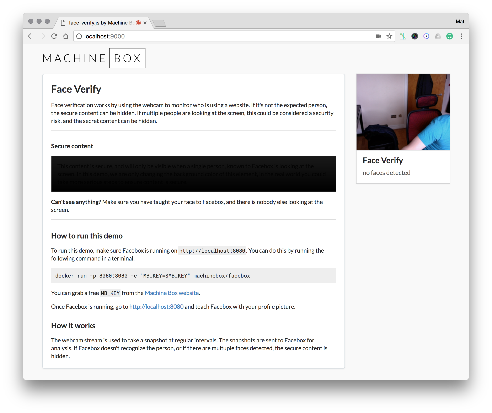
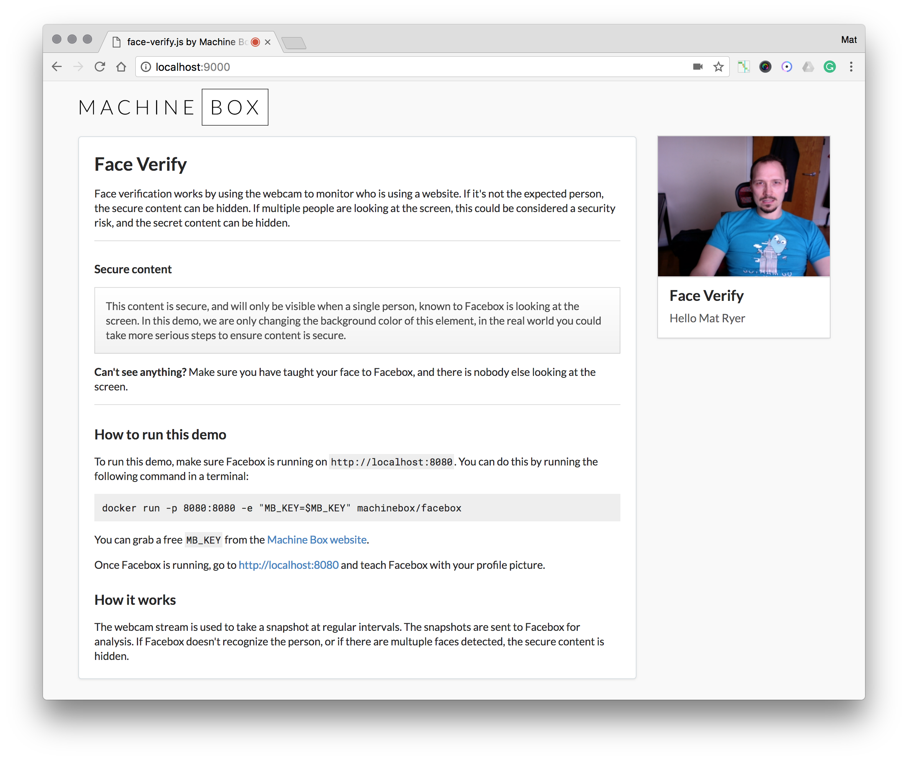

# Face Verify

* Uses the webcam to ensure only authorized people are looking at the website
* Automatically hides sensitive information
* Hides information if multiple people are looking at the screen

[Read the blog post about this feature](https://blog.machinebox.io/face-verify-js-monitoring-who-is-looking-at-a-website-for-additional-security-1d6025a8fedd) or [watch a 2 minute video seeing it in action](https://vimeo.com/255748109)

## Run the demo

* In the `demo` folder, do `go run run.go` (needs Go installed)
* Alternatively, serve the `public` folder in any web server
* Make sure you have Facebox running too

## Example

When it doesn't see Mat Ryer looking at the screen:

When it sees Mat Ryer:

