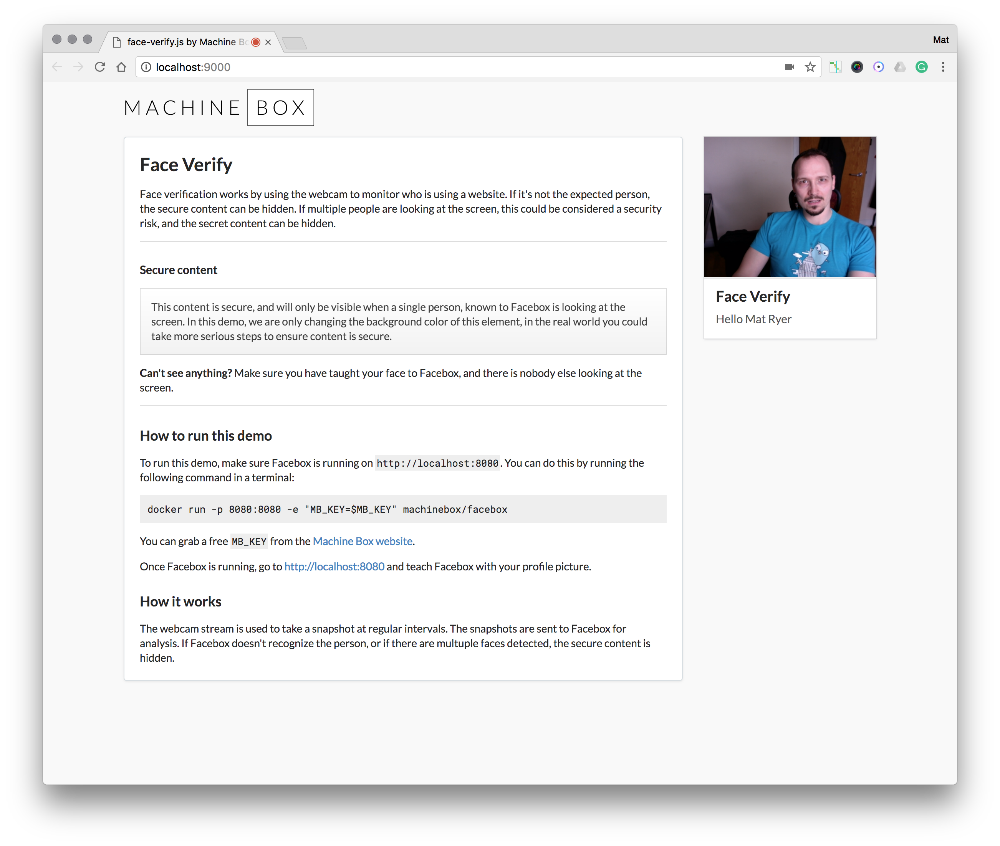

# Face Verify

* Uses the web cam to ensure only authorized people are looking at the website
* Automatically hides sensitive information
* Hides information if multiple people are looking at the screen

## Run the demo

* In the `demo` folder, do `go run run.go` (needs Go installed)
* Alternatively, serve the `public` folder in any web server
* Make sure you have Facebox running too
