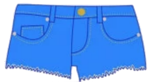

# nevernude



Tool for trimming nudity out of videos.

## Read the blog post

Check out the [blog post introducing this project](https://blog.machinebox.io/automatically-cut-out-nudity-from-videos-using-machine-box-ffmpeg-daa8578de8b5)

## How it works

Nevernude processes a video with [Videobox](https://machinebox.io/docs/videobox) and [Nudebox](https://machinebox.io/docs/nudebox)
and uses `ffmpeg` to break the video into segments, before stiching the non-nude bits back together into a new video.

## Usage

Use `docker-compose` to spin up Videobox and Nudebox. This will start two Docker containers, and connect them together.

```
$ cd github.com/machinebox/nevernude
$ docker-compose up
```

* You will need to have [Docker installed](https://machinebox.io/docs/setup/docker)
* You will need a [Box key from Machinebox.io](https://machinebox.io/docs/setup/box-key)

Build the `nevernude` tool:

```
$ cd github.com/machinebox/nevernude
$ go install
```

Run the `nevernude` tool on your video:

```
$ nevernude sourcevideo.mp4
```

After a while, a new video will be created (at `sourcevideo-nevernude.mp4`) that has nudity removed.

### Tweak behaviour

The following flags let you control `nevernude` run `nevernude --help`:

```
-out string
      output file (default will save file next to original)
-skipframes int
      number of frames to skip between extractions (see Videobox docs) (default -1)
-skipseconds int
      number of seconds to skip between extractions (see Videobox docs) (default -1)
-threshold float
      nudebox threshold (lower is more strict) (default 0.5)
-videobox string
      Videobox address (default "http://localhost:8080")
```

## Prerequisites 

* `ffmpeg` - You will need to [install ffmpeg](https://www.ffmpeg.org/download.html) 

# Finally

If you like Arrested Development, you can [buy the Nevernude mug](https://www.popsugar.com/entertainment/photo-gallery/42731657/image/42732389/Never-Nude-Mug-16).
